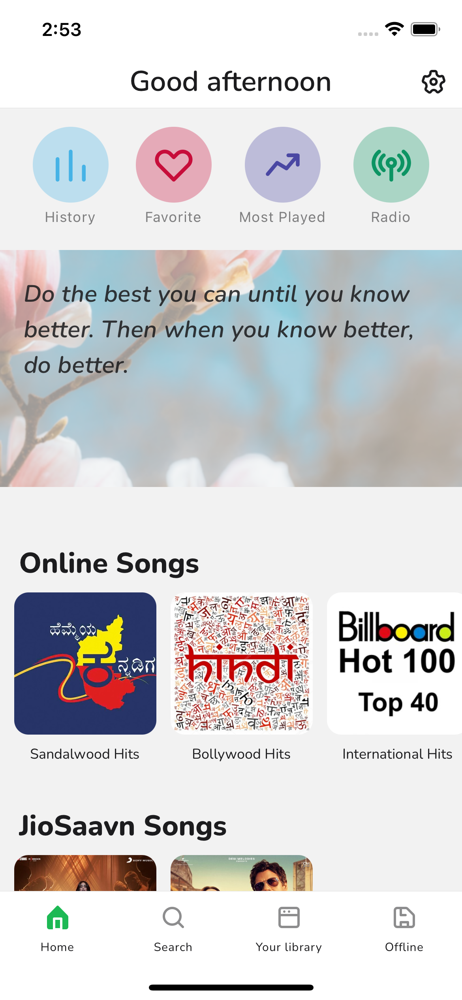
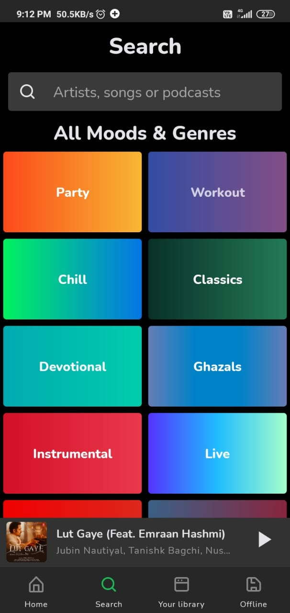
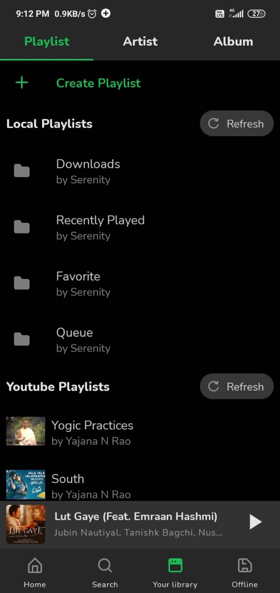
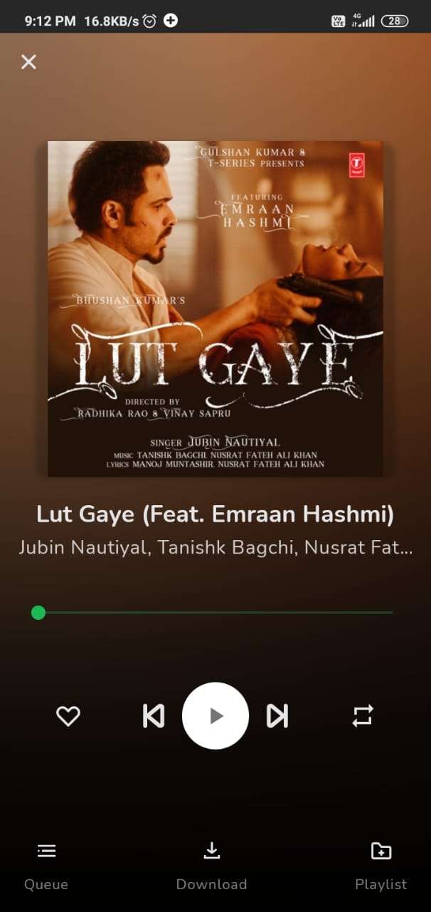
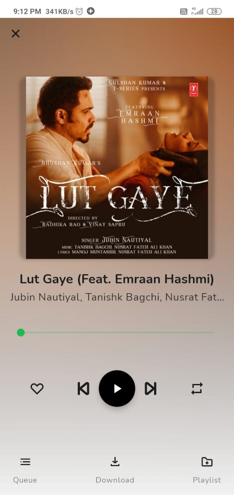

# Serenity 🏵️ App 5

## A ReactNative Music Player for Android and IOS 

A mobile music player focused on streaming from free sources. Built with Rich UI

## What is this?

Serenity is a world class music player which focuses on giving wonderful experience to the user.

## Aspects Involved

### Music

- In the words of Plato

  > Music gives a soul to the universe, wings to the mind, flight to the imagination and life to everything.

- In the words of Billy Joel

  > I think music in itself is healing. It’s an explosive expression of humanity. It’s something we are all touched by. No matter what culture we’re from, everyone loves music.

- In the words of Albert Schweitzer

  > There are two means of refuge from the miseries of life: music and cats.

### Artificial Intelligence

- Machine learning for Facial recognition

### Awesome UI

- > Beauty ain't always a little, cute colored flower. Beauty is anything where people be like, 'Damn.'
- In the words of Yajana

  > When I admire the wonders of an Application or the beauty of the UI, my soul expands in the worship of the creator

## Pre-alpha release

The current version is a pre-alpha early access. Some of it is usable, some of it isn't. If there are things that don't work as expected or are counterintuitive, please open an issue so I can prioritize working on them.

## Features

- Listen songs from local library
- Browsing by genre
- Create playlists and play songs from saved playlists
- Manage songs queue
- Radio mode (automatically queue similar tracks)
- Searching for and playing music from YouTube (including integration with YouTube playlists)
- Downloading audio from YouTube
- Play and Download Songs from JioSaavn
- Unlimited downloads

## Planned features

- Voice search songs
- Newest releases - tracks and albums
- Play and download songs from Google Drive
- Creating a backup on Google Drive and sync audio from it 🎶
- Searching for related songs in YouTube
- Multiple language support
- Real time lyrics
- Support for web (React Native Web) and Desktop (React Native Windows and MacOS)
- Searching for and playing music from bandcamp (including albums), and soundcloud
- Searching for albums (powered by last.fm and musicbrainz), album view, automatic song lookup based on artist and track name (in progress, can be dodgy sometimes)
- Newest releases with reviews - tracks and albums
- Browsing by popularity
- Country-specific top lists
- Listening suggestions (similar artists, albums, tracks)

## Development Process

Serenity is open to contributions, but I recommend creating an issue or replying in a comment to let me know what you are working on first that way we don't overwrite each other.

Please read [Setup.md](docs/Setup.md) for details on this project.

